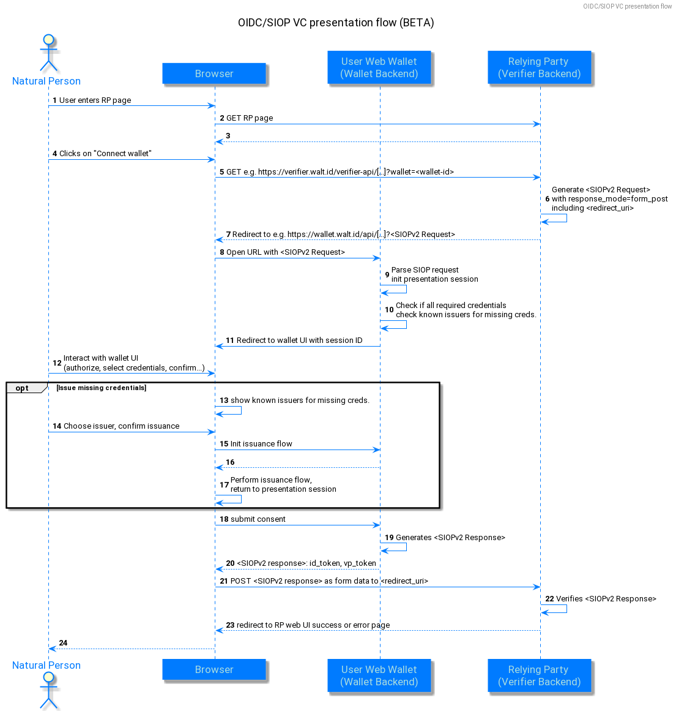
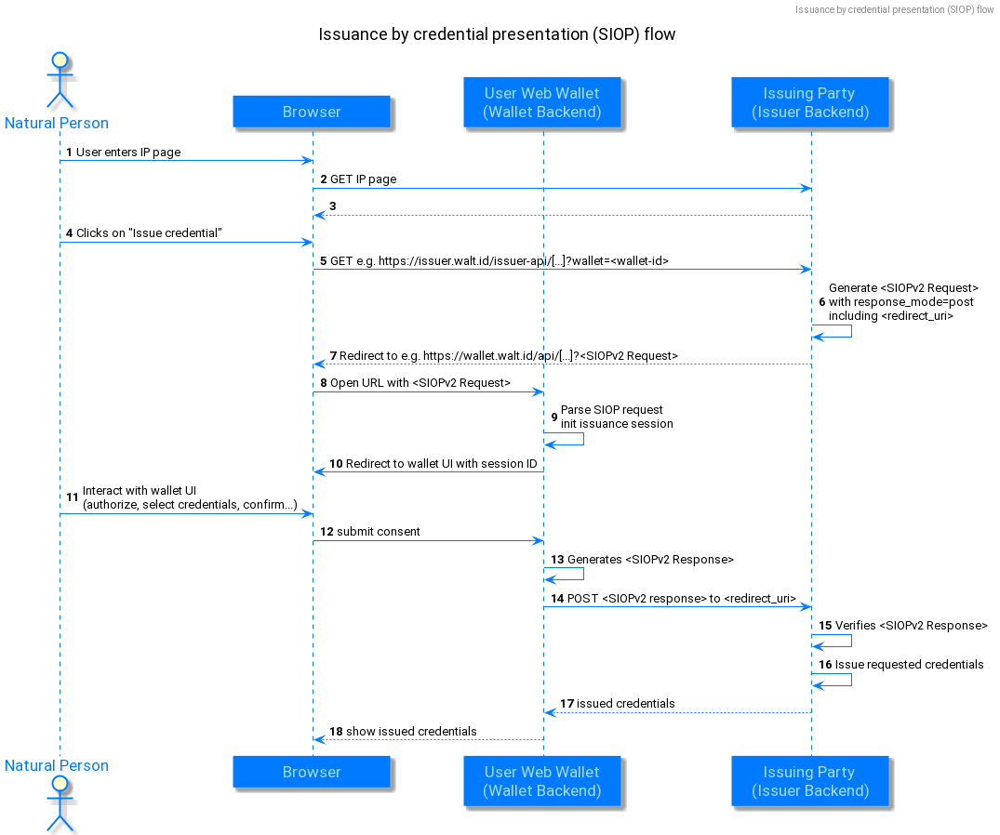
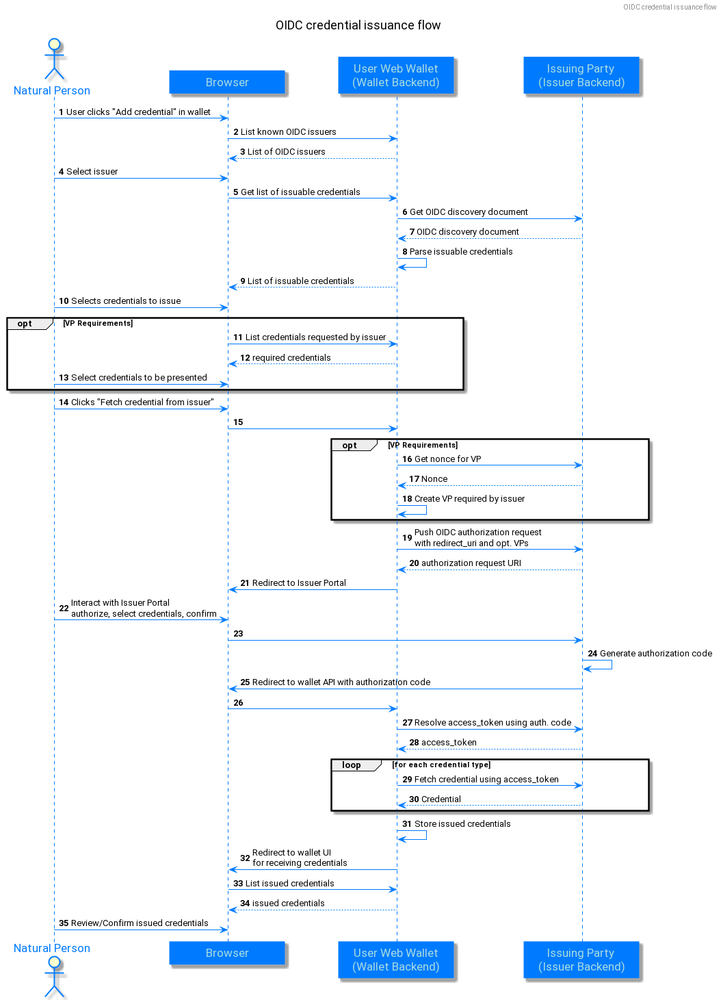

# SIOPv2

## Introduction

SIOP is an extension to OIDC (OpenID Connect). OIDC enables an user to use an OP (OpenID Provider) to release information to a RP (Relying Party).
SIOP changes this directive to cut out the OpenID Provider service in the middle, by becoming this role itself, now being called Self-Issued OP.
The DIDs, signing keys, and other identity information is now in the hands of the user.

Now, to make the information the user releases to the Relying party verifiable (= trustworthy), a separate protocol called "OpenID for Verifiable Presentations" (OIDC4VP) comes into play. It allows the Self-issued OpenID Provider to present verifiable claims in the form of a Verifiable Presentation (which itself contains Verifiable Credentials, oftentimes coming from external issuers).

## SIOP Protocol flow

1. The Relying Party sends an Authorization Request (SIOP Request) to the SIOP (the Self-Issued OpenID Provider of the user).
2. The above-mentioned request is being authenticated and authorized with SIOP and user. Usually, this encompasses a modal dialog request being shown to the user, asking if they wish to share a specific Verifiable Credential with the Relying Party.
3. If the request was successfully authenticated and authorized, the SIOP of the user will send a "Self-Issued ID Token" Token (SIOP Response) to the Relying Party. This ID token includes claims about the Authentication event, and could also encompass supplementary claims about the user.

## Requests

### Request transmission (Provider Invocation)

There are various ways how a SIOP request from a Relying Party may be transmitted to the users SIOP.

**The most recent standard does currently not specify any options on how the request are supposed to reach the user.** Furthermore, the standard indicates that there are currently absolutely no established or robust options for a Relying Party to determine where a users SIOP might be located, which one to use, or if there is even one installed at all. This means, that during a users first interaction with the Relying Party, according to the standard, the Relying Party would have to build a custom way to first and foremost find out the URL of the users SIOP where to direct the request to.

This has caused two options to be worth considering, both of which are valid and even mentioned in the standard:

#### 1. Out-of-band request transmission (request without `authorization_endpoint`)

This option does not involve actually calling an endpoint of a users SIOP, in fact, it isn't even possible, as the URL of the users SIOP is unknown.

This option involves encoding the request into e.g. an QR code for users to scan with their wallet, when it's installed on their smartphone, or encoding it into a deep-link, which opens up the users wallet, when it is installed on the same (e.g. desktop) platform as they are browsing the Relying Partys site on.

Please keep in mind that QR codes and links have a maximum useable size. To not have to cross this size, most of the "large" parameters have a -`_uri` suffixed version, which allows to not have to embed large JSON objects into the QR code / links.

Of course in this case, it is not necessary for the Relying Party to determine the users SIOP URL. Thus, no `authorization_endpoint` (URL of the users SIOP, could also be a custom URI scheme or Universal Link/App link) parameter is required.

##### Example request
```
response_type=id_token
&client_id=https%3A%2F%2Fclient.example.org%2Fcb
&request_uri=https%3A%2F%2Fclient.example.org%2Frequest
&scope=openid
&nonce=n-0S6_WzA2Mj
```

#### 2. In-band request transmission (request with `authorization_endpoint`)

On the contrary, the request would include the above-mentioned `authorization_endpoint`. The standard mentions two options on how to obtain it beforehand:

##### 1. Pre-obtaining the `authorization_endpoint`

The standard does not specify how the Relying Party is supposed to gain the users SIOP Issuer identifier, however one could simply ask the user in a modal/dialog.

Nonetheless, it mentions pre-obtaining SIOP Discovery Metadata using one of the following options:

###### 1. Using OpenID.Discovery (OpenID Connect Core 1.0 incorporating errata set 1).
This part of the specifications was (temporarily?) not accessible to the public, thus it could not be properly evaluated.

However, when OpenID.Discovery is used, the Relying Party has to fetch the metadata, comparable to the static set of SIOP metadata (but differing from the OpenID.Discovery specification, without `jwks_uri`), from the URL:
```
${siopIssuerIdentifier}/.well-known/openid-configuration
```

###### 2. Using out-of-band mechanisms.

##### 2. Using a static set of SIOP metadata

See "Statically obtained metadata".

##### SIOP metadata

The standard shows the following examples for obtained SIOP metadata:

###### Statically obtained metadata
```json
{
    "authorization_endpoint": "openid:",
    "response_types_supported": [
        "id_token"
    ],
    "scopes_supported": [
        "openid"
    ],
    "subject_types_supported": [
        "pairwise"
    ],
    "id_token_signing_alg_values_supported": [
        "ES256"
    ],
    "request_object_signing_alg_values_supported": [
        "ES256"
    ],
    "subject_syntax_types_supported": [
        "urn:ietf:params:oauth:jwk-thumbprint"
    ],
    "id_token_types_supported": [
        "subject_signed"
    ]
}
```

Please note:
- `subject_syntax_types_supported` might be removed in the future.
- `authorization_endpoint` must use the custom URI scheme `openid:`.
- The standard mentions that when using the above-mentioned custom URI scheme `openid:`, only native SIOP apps, but no web applications might open.

###### Dynamically obtained metadata
```json
{
    "authorization_endpoint": "https://wallet.example.org",
    "issuer": "https://example.org",
    "response_types_supported": [
        "id_token"
    ],
    "scopes_supported": [
        "openid"
    ],
    "subject_types_supported": [
        "pairwise"
    ],
    "id_token_signing_alg_values_supported": [
        "ES256K",
        "EdDSA"
    ],
    "request_object_signing_alg_values_supported": [
        "ES256K",
        "EdDSA"
    ],
    "subject_syntax_types_supported": [
        "urn:ietf:params:oauth:jwk-thumbprint",
        "did:key"
    ],
    "id_token_types_supported": [
        "subject_signed"
    ]
}
```

###### Metadata explanation

- `authorization_endpoint`
  - URL of the users SIOP, or
  - custom `openid:` URI scheme, or
  - Universal Link / App Link
- `issuer`
  - URL (with `https` scheme) of the users SIOPs Issuer Identifier
    - without any query
    - not including a fragment
    - same one that's used to resolve `${siopIssuerIdentifier}/.well-known/openid-configuration`
    - has to be identical to the `iss` claim in the ID token for the SIOP
- `id_token_types_supported`
  - JSON string-array listing ID tokens the OpenID Provider supports, being one of:
    - `attester_signed` (default)
      - ID token is issued by the controller of the OpenID Provider
      - (this is the classical ID token defined in OpenID.Core)
    - `subject_signed`
      - Self-issued ID Token
      - ID token is signed by the user
- `response_types_supported`
  - JSON stringarray of supported response types
  - simply has to be `id_token`
- `scopes_supported`
  - JSON stringarray of supported scopes
  - has to at least include `openid`
- `subject_types_supported`
  - JSON stringarray of supported subject types
  - Valid subject types include `public` and `pairwise`
- `id_token_signing_alg_values_supported`
  - JSON stringarray of the OpenID Providers supported JWS signing algorithms (for the ID Token to encode the Claims in a JWT)
  - Valid JWS signing algorithms (`alg`) include `EdDSA` (Ed25519), `RS256` (RSASSA-PKCS1-v1\_5 using SHA-256), `ES256` (ECDSA using NIST P-256 and SHA-256), `ES256K` (secp256k1, often recommeded)
- `request_object_signing_alg_values_supported`
  - same as above, for signing of Request Objects instead of signing of ID Tokens
  - same as above, and addional `none` for no signing (not recommended, they will of course not be signed)
- `subject_syntax_types_supported`
  - JSON stringarray with supported URI schemes
  - for JWK Thumbprint, this parameter is `urn:ietf:params:oauth:jwk-thumbprint`
    - in this case, the `sub` claim has to be a base64url encoded JWK thumbprint of the key that's in `sub_jwk`, and `sub_jwk` has to be included in the SIOP Response
  - for DIDs, the DID method has to be specified, e.g. `did:web` (no additional colon suffix shall be added, e.g. do _not_ use `did:web:`)
    - as a catch-all, using `did` will indicate support for all DID methods (not recommeded, as this is usually never the case)
    - in this case, `sub` has to be a valid DID, and `sub_jwk` shall not be included in the SIOP response

Example for `subject_syntax_types_supported`:
```json
{
  "subject_syntax_types_supported": [
    "urn:ietf:params:oauth:jwk-thumbprint",
    "did:example",
    "did:key"
  ]
}
```


##### Relying Party Metadata

Depending on whether the SIOP and the Relying Party have already had previously communicated, Relying Party Metadata obtention differs:

###### 1. SIOP <-> RP have previously communicated and are pre-registered

When the Relying Party has pre-registered with the users SIOP
- using OpenID.Registration,
- or out-of-band
the following demands have to be met:

- `client_id` has to be the client identifier (which the Relying Party obtained from the users SIOP during pre-registration)
- `client_metadata` must not be present in the request
- `client_metadata_uri` must not be present in the request

An example request in this case could be:

```
HTTP/1.1 302 Found
Location:  https://client.example.org/universal-link
            ?response_type=id_token
            &client_id=s6BhdRkqt3
            &redirect_uri=https%3A%2F%2Fclient.example.org%2Fcb
            &scope=openid%20profile
            &nonce=n-0S6_WzA2Mj
```

###### 2. SIOP <-> RP communicate for the first time or are not pre-registered

It is also possible to pass the metadata in the SIOP Authorization Request, but note, that this functions differently from registration (as the SIOP does not return a re-usable `client_id` to the Relying Party).

- Should the SIOP request be unsigned:
  - all client metadata has to be passed in `client_metadata` or `client_metadata_uri`
  - `client_id` has to be the `redirect_uri`
- Should the SIOP request be signed:
  - `client_id` of the Relying Party is resolved to the public key (which is used to verify the signature of the signed SIOP request)
  - the other Relying Party parameters have to be in either:
    - `client_metadata` in the SIOP request,
    - or in the OpenID Fed. 1.0 Automatic Registrations "Entity Statement"
  - `client_id` may not be `redirect_uri`
- `client_metadata` may not include `redirect_uris` (to prevent attackers from inserting malicious redirect URIs)

To specify:
- The above-mentioned `client_metadata` is a JSON object, containing the Relying Party parameters.
- The above-mentioned `client_metadata_uri` is a URI (with `https` scheme), resolving to a JSON object, containing the Relying Party parameters.
- Either `client_metadata` or `client_metadata_uri` shall be used, however not both at the same time.

An unsigned not-pre registered request may look like this:
```
HTTP/1.1 302 Found
Location: https://client.example.org/universal-link
  ?response_type=id_token
  &client_id=https%3A%2F%2Fclient.example.org%2Fcb
  &redirect_uri=https%3A%2F%2Fclient.example.org%2Fcb
  &scope=openid%20profile
  &nonce=n-0S6_WzA2Mj
  &registration=%7B%22subject_syntax_types_supported%22%3A
  %5B%22urn%3Aietf%3Aparams%3Aoauth%3Ajwk-thumbprint%22%5D%2C%0A%20%20%20%20
  %22id_token_signing_alg_values_supported%22%3A%5B%22RS256%22%5D%7D
```

A signed not-preregistered request using public key resolving with JWKS may look like this (`"client_id": "https://client.example.org"`):
```
HTTP/1.1 302 Found
Location: https://client.example.org/universal-link
  ?response_type=id_token
  &client_id=https%3A%2F%2Fclient.example.org%2F
  &redirect_uri=https%3A%2F%2Fclient.example.org%2Fcb
  &scope=openid%20profile
  &nonce=n-0S6_WzA2Mj
```

A signed not-preregistered request using public key resolving with DIDs may look like this (`"client_id": "did:example:EiDrihTRe0GMdc3K16kgJB3Xbl9Hb8oqVHjzm6ufHcYDGA"`):
```
  openid://
    ?scope=openid%20profile
    &response_type=id_token
    &client_id=did%3Aexample%3AEiDrihTRe0GMdc3K16kgJB3Xbl9Hb8oqVHjzm6ufHcYDGA
    &redirect_uri=https%3A%2F%2Fclient.example.org%2Fcb
    &claims=...
    &registration=%7B%22subject_syntax_types_supported%22%3A
    %5B%22did%3Aexample%22%5D%2C%0A%20%20%20%20
    %22id_token_signing_alg_values_supported%22%3A%5B%22ES256%22%5D%7D
    &nonce=n-0S6_WzA2Mj
```


### SIOP Authorization Request

#### SIOP Authorization Request Definition

- `scope` (Mandatory)
  - Same as in OpenID (see 3.1.2)
- `response_type` (Mandatory)
  - Has to be `id_token` (see `response_types_supported`)
- `client_id` (Mandatory)
  - Relying Partys identifier for the users SIOP
- `redirect_uri` (Mandatory)
  - URI where the SIOP Response will be sent to
- `id_token_hint` (Optional)
  - Same as in OpenID (see 3.1.2)
  - may have been encrypted to the Relying Party (in a previous transaction)
    - in this case, it is a Nested JWT, which has to be decrypted to retrieve the Self-issued ID Token
- `claims` (Optional)
  - Same as in OpenID (see 5.5)
- `client_metadata` (Optional)
  - In-request passing of information of the Relying Party to the users SIOP, see described above
  - exclusive to `client_metadata_uri`
- `client_metadata_uri` (Optional)
  - In-request passing of information of the Relying Party to the users SIOP, see described above
  - exclusive to `client_metadata`
- `request` (Optional)
  - Same as in OpenID (see 6.1)
  - may be encrypted to the users SIOP by the Relying Party
    - in this case, the subject `sub` of a previously issued ID Token for this Relying Party has to sent as the Key ID `kid` of the JWE
- `request_uri` (Optional)
  - Alternativly to passing the request object in `request`, it can be passed as a resolveable URI
- `id_token_type` (Optional)
  - String (not JSON list!) specifying the types of ID tokens the Relying Party is interested in, seperated by spaces, in descending order of preference
    - default is `attester_signed`
    - the other option is `subject_signed`
  - the Relying Party determines what ID token the users SIOP returned, by comparing the `iss` and `sub` claims.

Client metadata shall not be duplicated.
Pass it in one of the following attributes **exclusivly**:
- `client_metadata`
- `client_metadata_uri`
- `request`
- `request_uri`

Make sure to always send a unique `nonce` parameter with every request. It is used for replay attack detection.

##### Example request

```
HTTP/1.1 302 Found
Location: openid://
   ?scope=openid
   &response_type=id_token
   &client_id=https%3A%2F%2Fclient.example.org%2Fcb
   &redirect_uri=https%3A%2F%2Fclient.example.org%2Fcb
   &id_token_type=subject_signed
   &claims=...
   &registration=%7B%22subject_syntax_types_supported%22%3A
   %5B%22urn%3Aietf%3Aparams%3Aoauth%3Ajwk-thumbprint%22%5D%2C%0A%20%20%20%20
   %22id_token_signing_alg_values_supported%22%3A%5B%22ES256%22%5D%7D
   &nonce=n-0S6_WzA2Mj
```

#### Cross-Device SIOP Request specifics

- adds parameter `response_mode`, containing a HTTP endpoint
- adds response mode `post`
    - specifies, that the users SIOP shall deliver the authentication result to the endpoint at `response_mode` using HTTP POST
- authentication result is conveyed in standard `redirect_uri`

Usually (but not neccessarily always), cross-device SIOP Requests will have the SIOP run on a different device (e.g. a smartphone), than the one the user is accessing the site of the Relying Party with (e.g. a desktop computer).

##### Example request

```
openid://
    ?scope=openid%20profile
    &response_type=id_token
    &client_id=https%3A%2F%2Fclient.example.org%2Fpost_cb
    &redirect_uri=https%3A%2F%2Fclient.example.org%2Fpost_cb
    &response_mode=post
    &claims=...
    &registration=%7B%22subject_syntax_types_supported%22%3A
    %5B%22urn%3Aietf%3Aparams%3Aoauth%3Ajwk-thumbprint%22%5D%2C%0A%20%20%20%20
    %22id_token_signing_alg_values_supported%22%3A%5B%22ES256%22%5D%7D
    &nonce=n-0S6_WzA2Mj
```

### SIOP Authorization Response

The response depends on the value of the parameter `response_type` and the device flow:
- in a same-device flow:
    - if the `response_type` is `id_token`
        - response parameters are returned as URL fragment
    - if the `response_type` is `code`
        - response parameters are returned in the HTTP POST response body (of the token response)
- in a cross-device flow:
    - users SIOP sends a HTTP Post (with the Authorization Response) to an (previously specified) endpoint (of the Relying Party)

The response contains an ID Token and can be extended to include extension parameters, for example, an Verifiable Presentation (VP) Token (OIDC4VP).

#### Example responses

##### For same-device flows

for `response_type` = `id_token`:
```
HTTP/1.1 302 Found
Location: https://client.example.org/cb
    #id_token=...
```

for `response_type` = `code`:
```json
HTTP/1.1 200 OK
Content-Type: application/json
Cache-Control: no-store
Pragma: no-cache

{
    "access_token": "SlAV32hkKG",
    "token_type": "Bearer",
    "expires_in": 3600,
    "id_token": "..."
}
```

##### For cross-device flow
Calls the Relying Partys endpoint specified in `redirect_uri` as `application/x-www-form-urlencoded` with the Authorization Response

```
POST /post_cb HTTP/1.1
Host: client.example.org
Content-Type: application/x-www-form-urlencoded
    
id_token=...
```

#### Self-issued ID Token in the Response

##### Definition

Claims:
- `iss` (Mandatory)
    - for self-issued ID Tokens, this has to be the `sub` claim
- `sub` (Mandatory)
    - if "Subject Syntax Type" is "JWK Thumbprint"
        - this value is base64url encoded of the key thumbprint in the `sub_jwk` field
            - thumbprint value is constructed by: SHA256( Octects of UTF8 ( minimal JWK ) )
                - minimal JWK: only consisting of required fields, sorted alphabetically, without whitespace or linebreaks
                    - e.g.
                        - for `kty` = "RSA": `e`, `kty`, `n`
                        - for `kty` = "EC": `crv`, `kty`, `x`, `y`
    - if "Subject Syntax Type" is "DID" (Decentralized Identifier)
        - this value is a DID
- `sub_jwk` (Optional)
    - public key (to check signature of an ID Token)
    - only when "Subject Syntax Type" = "JWK Thumbprint"
    - bare key in JWK format (do not use a X.509 cert value)
    - do not use when "Subject Syntax Type" != "JWK Thumbprint"
    - not recommended when OpenID Provider is not Self-issued

##### Validation
The below-mentioned checks have to be conducted by the Relying Party:

###### Validation for self-issued ID Tokens

1. Check if the ID Token was issued by the users SIOP.
    - it is self-issued if `iss` == `sub` (subject has issued it themselves)
2. Check if the `aud` claim contains the value of `client_id` (which the Relying Party sent in the Authorization Request as an audience)
3. Check which "Subject Syntax Type" is used
    - if `sub` == `urn:ietf:params:oauth:jwk-thumbprint`, "Subject Syntax Type" is "JWK Thumbprint"
    - if `sub` starts with `did:` or is `did`, "Subject Syntax Type" is DID (Decentralized Identifier)
4. Check the signature of the ID Token
    - if "Subject Syntax Type" is "JWK Thumbprint", validate according to JWS
        - that is: using the algorithm in `alg` and using the key in claim `sub_jwk`
            - check if `alg` is supported (in `id_token_signing_alg_values_supported`)
    - if "Subject Syntax Type" is DID (Decentralized Identifier), validate against the key in the DID document
        - the DID document is obtained by resolving the DID in `sub`
        - if `verificationMethod` contains multiple keys, use the key with identified according to the value of `kid`
5. Check the `sub` value
    - if "Subject Syntax Type" is "JWK Thumbprint"
        - check that `sub` is the base64url encoded key thumbprint of the key in `sub_jwk`
    - if "Subject Syntax Type" is DID (Decentralized Identifier)
        - check that the DID in `sub` equals the DID in `id` in the DID document
6. Check times
    - Check that the expiration time in `exp` has not be overrun
    - Check that the issued-at time in `iat` is not in the future
8. Replay attack detecion
    - Check that the claim `nonce` is present and is equal to the one in the Authorization Request.
    - Check if the nonce has been reused.

###### Validation for cross-device self-issued ID Tokens
Apply all above-mentioned checks, and additionally check for unqiueness of the `nonce` claim (it should not have appeared previously).

###### Example Validation

For "Subject Syntax Type" = "DID":
```json
{
  "iss": "did:example:NzbLsXh8uDCcd6MNwXF4W7noWXFZAfHkxZsRGC9Xs",
  "sub": "did:example:NzbLsXh8uDCcd6MNwXF4W7noWXFZAfHkxZsRGC9Xs",
  "aud": "https://client.example.org/cb",
  "nonce": "n-0S6_WzA2Mj",
  "exp": 1311281970,
  "iat": 1311280970
}
```

##### Example ID Token

Example of a base64 url decoded Self-Issued ID Token when using the JWK Thumbprint Subject Syntax Type:
```json
{
  "iss": "NzbLsXh8uDCcd-6MNwXF4W_7noWXFZAfHkxZsRGC9Xs",
  "sub": "NzbLsXh8uDCcd-6MNwXF4W_7noWXFZAfHkxZsRGC9Xs",
  "aud": "https://client.example.org/cb",
  "nonce": "n-0S6_WzA2Mj",
  "exp": 1311281970,
  "iat": 1311280970,
  "sub_jwk": {
    "kty": "RSA",
    "n": "0vx7agoebGcQSuuPiLJXZptN9nndrQmbXEps2aiAFbWhM78LhWx4cbbfAAt
    VT86zwu1RK7aPFFxuhDR1L6tSoc_BJECPebWKRXjBZCiFV4n3oknjhMstn64tZ_2W
    -5JsGY4Hc5n9yBXArwl93lqt7_RN5w6Cf0h4QyQ5v-65YGjQR0_FDW2QvzqY368QQ
    MicAtaSqzs8KJZgnYb9c7d0zgdAZHzu6qMQvRL5hajrn1n91CbOpbISD08qNLyrdk
    t-bFTWhAI4vMQFh6WeZu0fM4lFd2NcRwr3XPksINHaQ-G_xBniIqbw0Ls1jF44-cs
    FCur-kEgU8awapJzKnqDKgw",
    "e": "AQAB"
  }
}
```

#### The different error codes of a SIOP Response

- User errors:
    - `user_cancelled`
        - User denied or cancelled the Authorization Request of the Relying Party
- Unsupported errors:
    - `registration_value_not_supported`
        - Users SIOP does not support a specific parameter in the request of the Relying Party
    - `subject_syntax_types_not_supported`
        - Users SIOP does not support any of the provided Subject Syntax Types (`subject_syntax_types_supported`) in the request of the Relying Party
- Invalid data errors:
    - `invalid_registration_uri`
        - `client_metadata_uri` in the SIOP request cannot be accessed or resolves to invalid data
    - `invalid_registration_object`
        - `client_metadata` contains a Relying Party object that is not valid

# OIDC4VP

OIDC4VP enables the presenation of claims, which take the form of VCs (Verifiable Credentials).

## Requesting Presentations

Verifiable Presentations (VPs) are requested by extending the Authorization Request by the parameter `presentation_definition`.

### Definition

#### `response_type`
When using OIDC4VP, one will use the value `vp_token` to have the Authorization Server return only a VP Token in the Authorization Response.

#### `scope`
Optional.

Wallets can support requesting credential presentations with scope values, such a scope value is supposed to map to a Presentation Definition, however, the standard does not define this in more detail.

#### Scope request example
```
GET /authorize
  ?response_type=vp_token
  &client_id=https%3A%2F%2Fclient.example.org%2Fcb
  &redirect_uri=https%3A%2F%2Fclient.example.org%2Fcb
  &scope=com.example.healthCardCredential_presentation
  &nonce=n-0S6_WzA2Mj HTTP/1.1
```

#### `presentation_definition`
A definition complying with the specification DIF Presentation Exchange 2.0.0

Use either `presentation_definition` or `presentation_definition_uri`, not both at the same time.

##### Simple constraint example
```json
{
    "id": "vp token example",
    "input_descriptors": [
        {
            "id": "id card credential",
            "format": {
                "ldp_vc": {
                    "proof_type": [
                        "Ed25519Signature2018"
                    ]
                }
            },
            "constraints": {
                "fields": [
                    {
                        "path": [
                            "$.type"
                        ],
                        "filter": {
                            "type": "string",
                            "pattern": "IDCardCredential"
                        }
                    }
                ]
            }
        }
    ]

```

##### Selective disclosure example
```json
{
    "id": "vp token example",
    "input_descriptors": [
        {
            "id": "id card credential with constraints",
            "format": {
                "ldp_vc": {
                    "proof_type": [
                        "Ed25519Signature2018"
                    ]
                }
            },
            "constraints": {
                "limit_disclosure": "required",
                "fields": [
                    {
                        "path": [
                            "$.type"
                        ],
                        "filter": {
                            "type": "string",
                            "pattern": "IDCardCredential"
                        }
                    },
                    {
                        "path": [
                            "$.credentialSubject.given_name"
                        ]
                    },
                    {
                        "path": [
                            "$.credentialSubject.family_name"
                        ]
                    },
                    {
                        "path": [
                            "$.credentialSubject.birthdate"
                        ]
                    }
                ]
            }
        }
    ]
}
```
##### Alternative credential request example
```json
{
    "id": "alternative credentials",
    "submission_requirements": [
        {
            "name": "Citizenship Information",
            "rule": "pick",
            "count": 1,
            "from": "A"
        }
    ],
    "input_descriptors": [
        {
            "id": "id card credential",
            "group": [
                "A"
            ],
            "format": {
                "ldp_vc": {
                    "proof_type": [
                        "Ed25519Signature2018"
                    ]
                }
            },
            "constraints": {
                "fields": [
                    {
                        "path": [
                            "$.type"
                        ],
                        "filter": {
                            "type": "string",
                            "pattern": "IDCardCredential"
                        }
                    }
                ]
            }
        },
        {
            "id": "passport credential",
            "format": {
                "jwt_vc": {
                    "alg": [
                        "RS256"
                    ]
                }
            },
            "group": [
                "A"
            ],
            "constraints": {
                "fields": [
                    {
                        "path": [
                            "$.vc.type"
                        ],
                        "filter": {
                            "type": "string",
                            "pattern": "PassportCredential"
                        }
                    }
                ]
            }
        }
    ]
}
```

#### `presentation_definition_uri`
Use the `presentation_definition_uri` if you do not want to send the whole presentation_definition in the URL (keep in mind size limitations of URLs in browsers and other components). It will be retrieved through a single, parameterless GET.

Use either `presentation_definition` or `presentation_definition_uri`, not both at the same time.

##### Request
The parameter value `https://server.example.com/presentationdefs?ref=idcard_presentation_request` will producte the following HTTP GET request:

```
GET /presentationdefs?ref=idcard_presentation_request HTTP/1.1
Host: server.example.com
```

##### Response

```json
HTTP/1.1 200 OK
...
Content-Type: application/json

{
    "id": "vp token example",
    "input_descriptors": [
        {
            "id": "id card credential",
            "format": {
                "ldp_vc": {
                    "proof_type": [
                        "Ed25519Signature2018"
                    ]
                }
            },
            "constraints": {
                "fields": [
                    {
                        "path": [
                            "$.type"
                        ],
                        "filter": {
                            "type": "string",
                            "pattern": "IDCardCredential"
                        }
                    }
                ]
            }
        }
    ]

```

#### `nonce`
Mandatory. Is used for replay attack detection and prevention, and functions exactly like in standard OpenID.Core

## Responding to requests

### Definition
#### response_type
- if `response_type` is only `vp_token`, only the VP Token is provided in the Authorization Response
- if `response_type` is `vp_token` and `id_token`, only the VP Token and the ID Token are provided in the Authentication Response
- else in all other cases, if `vp_token` is not used, but the parameter `presentation_definition` is present, the VP Token will be provided in the Token Response
- `response_type` parameter containing `vp_token` shall never include anything else except for optionally `id_token`

#### presentation_submission
A VP Token can either contain a list of VPs, or inline a single VP as a string.

##### Examples

###### HTTP Response example
```
HTTP/1.1 302 Found
Location: https://client.example.org/cb
  #presentation_submission=...
  &vp_token=...
```

###### Single inlined VP example

**VP Token example**
```json
{
    "@context": [
        "https://www.w3.org/2018/credentials/v1"
    ],
    "type": [
        "VerifiablePresentation"
    ],
    "verifiableCredential": [
        {
            "@context": [
                "https://www.w3.org/2018/credentials/v1",
                "https://www.w3.org/2018/credentials/examples/v1"
            ],
            "id": "https://example.com/credentials/1872",
            "type": [
                "VerifiableCredential",
                "IDCardCredential"
            ],
            "issuer": {
                "id": "did:example:issuer"
            },
            "issuanceDate": "2010-01-01T19:23:24Z",
            "credentialSubject": {
                "given_name": "Fredrik",
                "family_name": "Str&#246;mberg",
                "birthdate": "1949-01-22"
            },
            "proof": {
                "type": "Ed25519Signature2018",
                "created": "2021-03-19T15:30:15Z",
                "jws": "eyJhbGciOiJFZERTQSIsImI2NCI6ZmFsc2UsImNyaXQiOlsiYjY0Il19..PT8yCqVjj5ZHD0W36zsBQ47oc3El07WGPWaLUuBTOT48IgKI5HDoiFUt9idChT_Zh5s8cF_2cSRWELuD8JQdBw",
                "proofPurpose": "assertionMethod",
                "verificationMethod": "did:example:issuer#keys-1"
            }
        }
    ],
    "id": "ebc6f1c2",
    "holder": "did:example:holder",
    "proof": {
        "type": "Ed25519Signature2018",
        "created": "2021-03-19T15:30:15Z",
        "challenge": "n-0S6_WzA2Mj",
        "domain": "https://client.example.org/cb",
        "jws": "eyJhbGciOiJFZERTQSIsImI2NCI6ZmFsc2UsImNyaXQiOlsiYjY0Il19..GF5Z6TamgNE8QjE3RbiDOj3n_t25_1K7NVWMUASe_OEzQV63GaKdu235MCS3hIYvepcNdQ_ZOKpGNCf0vIAoDA",
        "proofPurpose": "authentication",
        "verificationMethod": "did:example:holder#key-1"
    }
}
```

**Corresponding `presentation_submission` example**
```json
{
    "id": "Selective disclosure example presentation",
    "definition_id": "Selective disclosure example",
    "descriptor_map": [
        {
            "id": "ID Card with constraints",
            "format": "ldp_vp",
            "path": "$",
            "path_nested": {
                "format": "ldp_vc",
                "path": "$.verifiableCredential[0]"
            }
        }
    ]
}
```

###### Multi VP example

**VP Token example**
```json
[
    {
        "@context": [
            "https://www.w3.org/2018/credentials/v1"
        ],
        "type": [
            "VerifiablePresentation"
        ],
        "verifiableCredential": [
            {
                "@context": [
                    "https://www.w3.org/2018/credentials/v1",
                    "https://www.w3.org/2018/credentials/examples/v1"
                ],
                "id": "https://example.com/credentials/1872",
                "type": [
                    "VerifiableCredential",
                    "IDCardCredential"
                ],
                "issuer": {
                    "id": "did:example:issuer"
                },
                "issuanceDate": "2010-01-01T19:23:24Z",
                "credentialSubject": {
                    "given_name": "Fredrik",
                    "family_name": "Str&#246;mberg",
                    "birthdate": "1949-01-22"
                },
                "proof": {
                    "type": "Ed25519Signature2018",
                    "created": "2021-03-19T15:30:15Z",
                    "jws": "eyJhbGciOiJFZERTQSIsImI2NCI6ZmFsc2UsImNyaXQiOlsiYjY0Il19..PT8yCqVjj5ZHD0W36zsBQ47oc3El07WGPWaLUuBTOT48IgKI5HDoiFUt9idChT_Zh5s8cF_2cSRWELuD8JQdBw",
                    "proofPurpose": "assertionMethod",
                    "verificationMethod": "did:example:issuer#keys-1"
                }
            }
        ],
        "id": "ebc6f1c2",
        "holder": "did:example:holder",
        "proof": {
            "type": "Ed25519Signature2018",
            "created": "2021-03-19T15:30:15Z",
            "challenge": "n-0S6_WzA2Mj",
            "domain": "https://client.example.org/cb",
            "jws": "eyJhbGciOiJFZERTQSIsImI2NCI6ZmFsc2UsImNyaXQiOlsiYjY0Il19..GF5Z6TamgNE8QjE3RbiDOj3n_t25_1K7NVWMUASe_OEzQV63GaKdu235MCS3hIYvepcNdQ_ZOKpGNCf0vIAoDA",
            "proofPurpose": "authentication",
            "verificationMethod": "did:example:holder#key-1"
        }
    },
    {
        "presentation":
        "eyJhbGciOiJSUzI1NiIsInR5cCI6IkpXVCIsImtpZCI6ImRpZDpleGFtcGxlOmFiZmUxM2Y3MTIxMjA0
        MzFjMjc2ZTEyZWNhYiNrZXlzLTEifQ.eyJzdWIiOiJkaWQ6ZXhhbXBsZTplYmZlYjFmNzEyZWJjNmYxY
        zI3NmUxMmVjMjEiLCJqdGkiOiJodHRwOi8vZXhhbXBsZS5lZHUvY3JlZGVudGlhbHMvMzczMiIsImlzc
        yI6Imh0dHBzOi8vZXhhbXBsZS5jb20va2V5cy9mb28uandrIiwibmJmIjoxNTQxNDkzNzI0LCJpYXQiO
        jE1NDE0OTM3MjQsImV4cCI6MTU3MzAyOTcyMywibm9uY2UiOiI2NjAhNjM0NUZTZXIiLCJ2YyI6eyJAY
        29udGV4dCI6WyJodHRwczovL3d3dy53My5vcmcvMjAxOC9jcmVkZW50aWFscy92MSIsImh0dHBzOi8vd
        3d3LnczLm9yZy8yMDE4L2NyZWRlbnRpYWxzL2V4YW1wbGVzL3YxIl0sInR5cGUiOlsiVmVyaWZpYWJsZ
        UNyZWRlbnRpYWwiLCJVbml2ZXJzaXR5RGVncmVlQ3JlZGVudGlhbCJdLCJjcmVkZW50aWFsU3ViamVjd
        CI6eyJkZWdyZWUiOnsidHlwZSI6IkJhY2hlbG9yRGVncmVlIiwibmFtZSI6IjxzcGFuIGxhbmc9J2ZyL
        UNBJz5CYWNjYWxhdXLDqWF0IGVuIG11c2lxdWVzIG51bcOpcmlxdWVzPC9zcGFuPiJ9fX19.KLJo5GAy
        BND3LDTn9H7FQokEsUEi8jKwXhGvoN3JtRa51xrNDgXDb0cq1UTYB-rK4Ft9YVmR1NI_ZOF8oGc_7wAp
        8PHbF2HaWodQIoOBxxT-4WNqAxft7ET6lkH-4S6Ux3rSGAmczMohEEf8eCeN-jC8WekdPl6zKZQj0YPB
        1rx6X0-xlFBs7cl6Wt8rfBP_tZ9YgVWrQmUWypSioc0MUyiphmyEbLZagTyPlUyflGlEdqrZAv6eSe6R
        txJy6M1-lD7a5HTzanYTWBPAUHDZGyGKXdJw-W_x0IWChBzI8t3kpG253fg6V3tPgHeKXE94fz_QpYfg
        --7kLsyBAfQGbg"
    }
]
```

**Corresponding `presentation_submission` example**

```json
{
    "id": "Selective disclosure example presentation",
    "definition_id": "Selective disclosure example",
    "descriptor_map": [
        {
            "id": "ID Card with constraints",
            "format": "ldp_vp",
            "path": "$[0]",
            "path_nested": {
                "format": "ldp_vc",
                "path": "$[0].verifiableCredential[0]"
            }
        },
        {
            "id": "Ontario Health Insurance Plan",
            "format": "jwt_vp",
            "path": "$[1].presentation",
            "path_nested": {
                "format": "jwt_vc",
                "path": "$[1].presentation.vp.verifiableCredential[0]"
            }
        }
    ]
}
```

## OIDC4VP Metadata

There is some extra metadata allowing Server & Client to negotiate supported VC & VP formats, proof types and algorithms.

### Server Metadata

#### `vp_formats_supported`
Object listing Key-Value pairs, keys being a supported credential format, value being an `alg_values_supported` list, which contains supported cryptographic algorithm suite names.

##### JSON example
```json
vp_formats_supported": {
‌ "jwt_vc": {
  ‌ "alg_values_supported": [
    ‌ "ES256K",
    ‌ "ES384"
  ‌ ]
‌ },
‌ "jwt_vp": {
  ‌ "alg_values_supported": [
    ‌ "ES256K",
     "EdDSA"
  ‌ ]
‌ }
}
```

### Client Metadata
Similar to SIOP, metadata can be provided
- either with Dynamic Registration,
- or out-of-band.

As with SIOP, there is:
- `client_metadata`
    - JSON object of Relying Party Registration Metadata
- `client_metadata_uri`
    - URL resolving to a JSON object of Relying Party Registration Metadata
They are mutually exclusive and cannot be used at the same time.

The `client_metadata` may contain:
- `vp_formats`: Mandatory
    - Relying Party declares what Verifiable Presentation formats it supports (e.g. `jwt_vc`, `ldp_vc`, `jwt_jp`, `ldp_vp`)

#### JSON example

**Request example:**
```json
HTTP/1.1 302 Found
Location: https://client.example.org/universal-link
    ?response_type=vp_token
    &client_id=https%3A%2F%2Fclient.example.org%2Fcb
    &redirect_uri=https%3A%2F%2Fclient.example.org%2Fcb
    &presentation_definition=...
    &nonce=n-0S6_WzA2Mj
    &client_metadata=%7B%22vp_formats%22:%7B%22jwt_vp%22:%
    7B%22alg%22:%5B%22EdDSA%22,%22ES256K%22%5D%7D,%22ldp
    _vp%22:%7B%22proof_type%22:%5B%22Ed25519Signature201
    8%22%5D%7D%7D%7D
```

**Relying Party registered with OpenID Dynamic Client registration:**
```json
{
   "client_id": "s6BhdRkqt3",
   "redirect_uris": [
      "https://client.example.org/callback",
      "https://client.example.org/callback2"
   ],
   "client_name": "My Example",
   "token_endpoint_auth_method": "client_secret_basic",
   "application_type": "web",
   "response_types": "code",
   "grant_types": "authorization_code",
   "vp_formats": {
      "jwt_vp": {
         "alg": [
            "EdDSA",
            "ES256K"
         ]
      },
      "ldp_vp": {
         "proof_type": [
            "Ed25519Signature2018"
         ]
      }
   }
}
```

**Sending the metadata in with a presentation request:**
```json
{
   "client_id": "s6BhdRkqt3",
   "redirect_uris": [
      "https://client.example.org/callback"
   ],
   "client_name": "My Example (SIOP)",
   "application_type": "web",
   "response_types": "id_token",
   "registration": {
      "vp_formats": {
         "jwt_vp": {
            "alg": [
               "EdDSA",
               "ES256K"
            ]
         },
         "ldp_vp": {
            "proof_type": [
               "Ed25519Signature2018"
            ]
         }
      }
   }
}
```

## OIDC4VP Verifier-initiated cross-device protocol flow

This flow is similar to the SIOP cross-device flow. Most of therein mentioned applies the same here.

### Authorization Request
Similar to the SIOP request flow, the request has to e.g. be encoded into a QR code, rendered and displayed to the user to scan.

Please keep in mind that QR codes and links have a maximum useable size. To not have to cross this size, most of the "large" parameters have a -`_uri` suffixed version, which allows to not have to embed large JSON objects into the QR code / links.
In this case, this would correspond to `request_uri`.

### Authorization Response
As with the SIOP cross-device flow, the special `response_mode` called `post` is used.
When used, as with the SIOP cross-devic flow, the Authorization Result will be transmitted to the URL in the parameter `redirect_uri`.

**Request object example with `response_mode` `post`:**
```json
{
   "client_id": "https://client.example.org/post",
   "redirect_uris": ["https://client.example.org/post"],
   "response_types": "vp_token",
   "response_mode": "post"
   "presentation_definition": {...},
   "nonce": "n-0S6_WzA2Mj"
}
```

**This request object can be used in a request URL like this:**
```
https://wallet.example.com?
    client_id=https%3A%2F%2Fclient.example.org%2Fcb
    &request_uri=https%3A%2F%2Fclient.example.org%2F567545564
```
This would be used either directly, or as an QR code.

**Which would in turn result in this POST response to the verifier:**
```
POST /post HTTP/1.1
Host: client.example.org
Content-Type: application/x-www-form-urlencoded

  presentation_submission=...
  &vp_token=...
```

## Combining both SIOPv2 and OIDC4VP

## Request example
```
GET /authorize
  ?response_type=id_token
  &scope=openid
  &id_token_type=subject_signed
  &client_id=https%3A%2F%2Fclient.example.org%2Fcb
  &redirect_uri=https%3A%2F%2Fclient.example.org%2Fcb
  &presentation_definition=...
  &nonce=n-0S6_WzA2Mj HTTP/1.1
Host: wallet.example.com
```

## Response example
```
HTTP/1.1 302 Found
Location: https://client.example.org/cb
  #id_token=
  &presentation_submission=...
  &vp_token=...
```

The above-mentioned `presentation_submission` contains both a SIOP `id_token` and a OIDC4VP `vp_token`.
Such an `id_token` may look like the following:
```json
{
    "iss": "did:example:NzbLsXh8uDCcd6MNwXF4W7noWXFZAfHkxZsRGC9Xs",
    "sub": "did:example:NzbLsXh8uDCcd6MNwXF4W7noWXFZAfHkxZsRGC9Xs",
    "aud": "https://client.example.org/cb",
    "nonce": "n-0S6_WzA2Mj",
    "exp": 1311281970,
    "iat": 1311280970
}
```

# Diagrams

## SIOP VC presentation flow


## Issuance by Presentation


## OIDC for Credential Issuance

